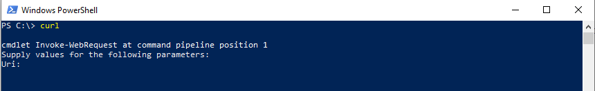
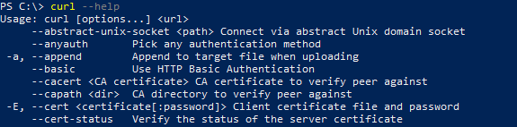

# Setting Up Kubernetes On Windows

## Motivation(s) For This Document

**Priority: Low**


Engineering is increasingly so a matter of stringing together the right resources - nicely wrapping and applying glue to the orthogonal boundaries between services.
Many resources on the web are partial, lack thorough research, or - simply - are piecemeal hacks solving problems that have _better_ solutions. This entry in my _learnings_
repository strings together official (and unofficial) documentation to increase your confidence that you are applying glue in the right areas - and doing so
with a bit of finesse that will make you feel like a programmer god.

### Anything Windows Sucks

Windows sometimes feels like the bastard child no one in the family wants to acknowledge. Windows shows up to dinner - strung out, hungover, down on its luck - and our parental sympathies kick in: "I _guess_ I should support you". Linux and Mac roll their eyes and the hardcore Engineer parents regurgitate some meaningless platitudes. But Windows doesn't have to suck - in fact, familiarize yourself with the [recently-revamped Powershell (WSL2)](https://docs.microsoft.com/en-us/windows/wsl/about) and the beauty of Windows OS begins to unveil.

#### Windows Has Every Opinion

Microsoft wants to be the cool kid. This deep desire is reflected in _everything_ Microsoft releases: languages, editors, utilities, short cuts, cloud solutions, etc. Microsoft doesn't really seem to break ground (VS Code; TS aside). Microsoft isn't the trend setter (sorry Microsoft, I promise I love you), Microsoft is the trend follower. By many developers, engineers, support specialists - whatever the professional flavor - Microsoft seems to always have been deemed wholly incomplete; so much so that one of the first things I used to tell my students to do - or my new-to-field colleagues - was install some sort of terminal emulator like [Cmder](https://cmder.net/) because Windows never did everything as quickly as you wanted it to (the reasonings behind this being myriad).

One of my former colleagues hated C#. Unlike a language like Java (which I think is massively behind the times), C# does not have an opinion about how it should be written. Opinions about its composition are not built into the language through the lack of feature set additions. C# sees another language - say Java or JavaScript - adopt a functionality - say lambda functions or duck typing - and without care for its relevance integrates it.

All of this is to say: **knowing** how to do something _right_ in the complex world of Microsoft is often difficult. Microsoft allows you to have every opinion you could possibly want to have.

### Could I Learn This Elsewhere? 

Probably. I learn by writing. So while - hopefully - you learn by reading my ramblings, I learn by composing this document.

## What This Document Is Not

**Priority: Medium**

This document is not intended to teach the basics of Kubernetes. This document assumes you already know why you want to install Kubernetes on your local machine. There's a lot that goes into understanding Kubernetes (though apparently less than what network administration used to be) and some assumptions are built into this document. I will try to address those as they arise.

## What This Document Is

**Priority: High**

1. This document is supplemental to the official [Kubernetes documentation for setting up Kubernetes on a local environment](https://kubernetes.io/docs/tasks/tools/install-kubectl/). 
1. This document intends to enable you to follow the Kubernetes documentation seemlessly and more technically while outfitting you with tools to do things in a more sophisticated manner down the road. 
1. This document is meant to get you set up for local Kubernetes development _not_ for deploying Kubernetes-based services to the cloud.

## Set Up

### cURL

**Priority: Required (High)**

[cURL](https://curl.se/) (pronounced as the word "curl") is a tool with which I recommend developers become familiar - it's used (and contributed to) by a large number of companies. To describe cURL, I will borrow directly from the cURL homepage: 

> curl is used in command lines or scripts to transfer data.

That's it. cURL supports a wide range of protocols - again from the documentation: 

> DICT, FILE, FTP, FTPS, GOPHER, GOPHERS, HTTP, HTTPS, IMAP, IMAPS, LDAP, LDAPS, MQTT, POP3, POP3S, RTMP, RTMPS, RTSP, SCP, SFTP, SMB, SMBS, SMTP, SMTPS, TELNET and TFTP

In a full-stack Engineering context, cURL often used as a catalyst for HTTP transactions. And that's how we will use it. 

:heavy_check_mark: We will use cURL to install Kubernetes on our machines.

If you open Windows Powershell and execute `curl` in the terminal you will notice output is logged to the console. Do not be fooled by Powershell, here: this is Powershell aliasing it's own `Invoke-WebRequest` command (and it's stupidly misleading). Don't worry about that for now, we'll solve that, soon.



Getting cURL on a Windows machine is a bit tedious. I'll reproduce the steps, here. For a more thorough explanation, I encourage you to read the [StackOverflow answer on installing cURL on Windows](https://stackoverflow.com/a/16216825/3469725).

To get cURL on your Windows machine, simply: 

1. Visit the [cURL Windows packages repository](https://curl.se/windows/).
1. Download the correct _.zip_ file for your environment.
1. Extract the executable contents of that file to a permanent location on your machine. I chose `C:\Program Files\curl` (a directory I created in `Program Files`).
    - the executable contents of that file are most likely found in the `\bin` directory of the extract. I copied the entire contents of the `\bin` directory: the `.dll`, `.exe`, `.crt`, and `.def` files.
1. Add the location of the `.exe` file to you Windows Environmental Variables System PATH. 

#### Not Done Yet

Even if you restart your Powershell, you should still get the above output that mocks `curl`. After restarting Powershell (I always run it as an Administrator), run the following command: 

```powersell
Remove-item alias:curl
```

You may have to do this on every start of Powershell where you intend to interact with cURL via the command line. This command removes the association of the `curl` keyword with the `WebRequest-Invoke` command mentioned earlier. You shouldn't need to restart Powershell after running this command.

Now, if you run: 

```powershell
curl --help
```

You should get some more meaningful output:



### Chocolatey

**Priority: Required (High)**

[Chocolately](https://chocolatey.org/about) is a Windows-oriented package manager that enables users to install utilities (software) via the command line. Installing it on a Windows machine looks a bit tricky when consulting their documentation, but the conceptual underpinnings and the procedure itself are quite simple. 

:heavy_check_mark: We will use Chocolatey as a part of our Kubernetes development environment set up. 


